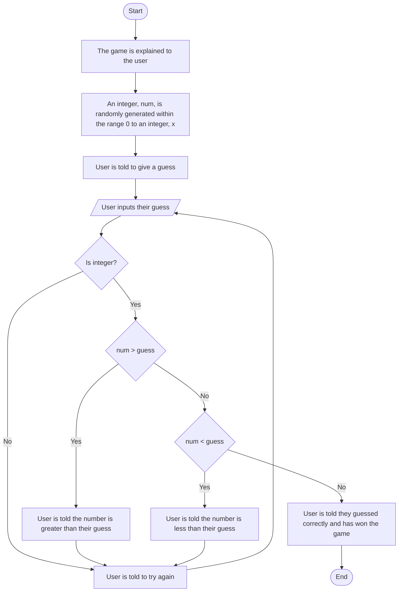

# Guessing Game
## Flowchart

## Documentation
1. The game is explained to the user as followed.
> A random number within the range 0 to a specified number is generated.
> Feedback will be provided on whether the guess is too high, too low, or is correct.
2. The user enters their guess.
3. The program checks whether the user's guess is an integer.
   * If the guess is not an integer, the user is told to try again.
   * If the guess is an integer, the program continues.
4. The program checks if the guess is less than the randomly generated number.
   * If it is, the user is told the number is greater than their guess and to try again.
   * If it is not, the program continues.
5. The program checks if the guess is greater than the randomly generated number.
   * If it is, the user is told the number is less than their guess and to try again.
   * If it is not, the program continues.
6. The user has won if they reach this point since the guess is not greater than or less than the randomly generated number and therefore, the guess is equal to the number.
